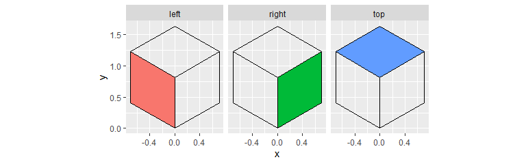
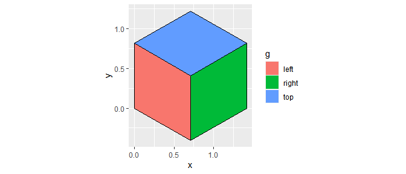
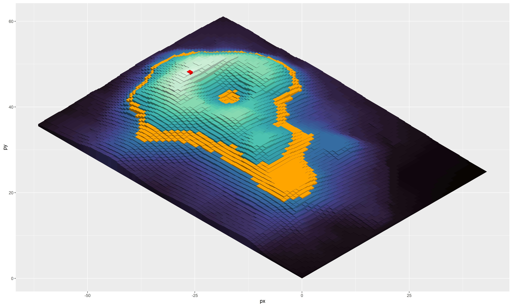
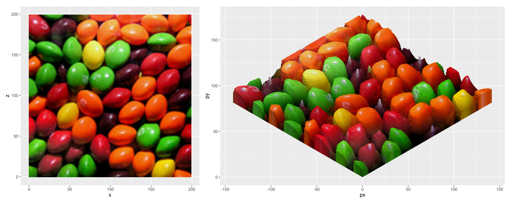
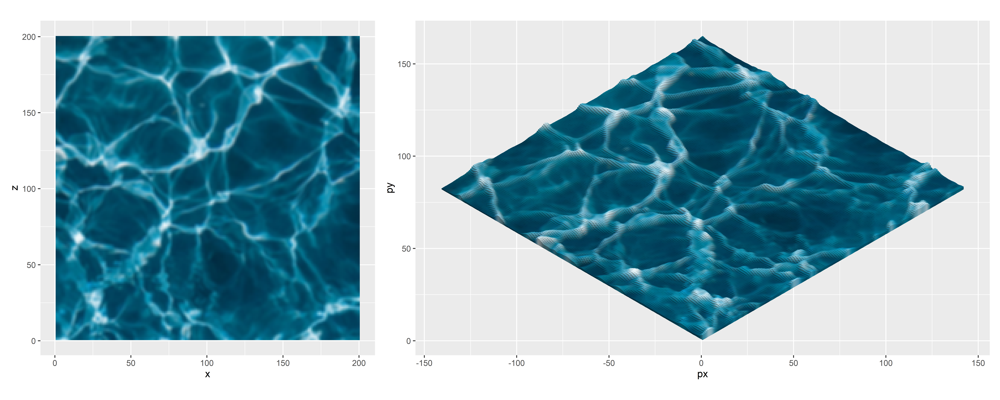
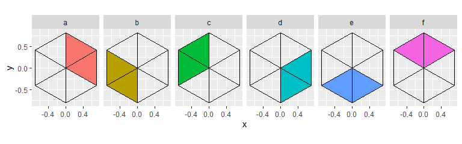
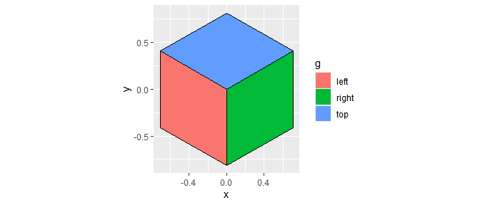
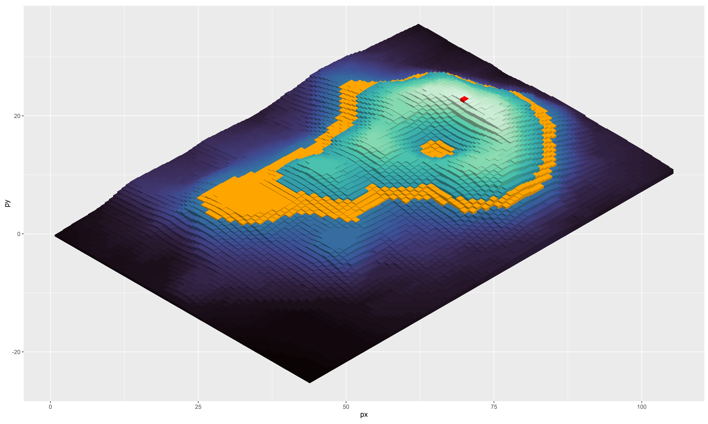

<!-- README.md is generated from README.Rmd. Please edit that file -->

# Isometric height maps

## Intro

-   This readme documents a project I started nearly 1.5 years ago and
    only revisited again in the last week!
-   It’s an attempt at using isometric projection to create pseudo 3D
    images from data. I’m sharing it here primarily to document what I
    learnt but also in case it can be a useful starting point for
    someone else.
-   This is a project that I created for fun and personal development,
    so its slow and likely to be inaccurate. **It’s certainly
    experimental**. There are however some incredibly cool R packages
    for doing this type of thing properly…
    -   [rayshader](https://github.com/tylermorganwall/rayshader)
    -   [isocubes](https://github.com/coolbutuseless/isocubes)

##### Disclaimer

-   I am not a smart man.
    -   My maths is…OK, but I have very much ‘brute force’ got this to
        work via naive copying of equations from [this Wikipedia
        article](https://en.wikipedia.org/wiki/Isometric_projection). My
        test of *‘is it working?’* is based solely on a visual
        inspection of the outputs to see that they don’t look obviously
        wrong!
    -   As a result, I may have got things incorrect, or had to insert
        spurious minus signs to get things to not render as mirror
        images of themselves etc!

## Packages

``` r
library(tidyverse)
library(magick)
```

## Rotation matrices and unit-cube

-   Define a function `iso_project` that takes
    1.  The rotation angles around the vertical and horizontal axes (in
        degrees because that’s how my brain works)
    2.  The 3D coordinates x, y, z
-   This function then computes the rotation matrices for these angles
    and applies the matrix multiplication transformation (vectorised)
    over x, y and z
-   This is my interpretation of the [Wikipedia
    article](https://en.wikipedia.org/wiki/Isometric_projection)

``` r
iso_project <-
  function(x, y, z,
           va = 45, 
           ha = asin(tan(pi/6))*(180/pi)
  ){
    
    # Convert rotation angles to radians
    var <- va*(pi/180)
    har <- ha*(pi/180)
    
    # Construct rotation matrices
    m1a <- 
      matrix(c(1, 0, 0,
               0, cos(har), sin(har),
               0, -sin(har), cos(har)),
             byrow = TRUE,
             ncol = 3)
    
    m1b <- 
      matrix(c(cos(var), 0, -sin(var),
               0, 1, 0,
               sin(var), 0, cos(var)),
             byrow = TRUE,
             ncol = 3)
    
    m2 <- matrix(c(1,0,0,0,1,0,0,0,0), byrow = TRUE, nrow=3, ncol=3)
    
    # Perform vectorised matrix multiplication
    Vectorize(function(x, y, z) m2 %*% ((m1a %*% m1b) %*% matrix(c(x, y, z))))(x, y, z)
  }
```

-   Now define the x, y, z coordinates of the 6 sides of the unit cube
    in 3D space

``` r
full_unit_cube_df <-
  tribble(
    ~g,   ~ux, ~uy, ~uz,
    "a",  0,  0,  0,
    "a",  0,  1,  0,
    "a",  1,  1,  0,
    "a",  1,  0,  0,

    "b",  0,  0,  -1,
    "b",  0,  1,  -1,
    "b",  1,  1,  -1,
    "b",  1,  0,  -1,

    "c",  0,  0,  0,
    "c",  0,  0,  -1,
    "c",  0,  1,  -1,
    "c",  0,  1,  0,

    "d",  1,  0,  0,
    "d",  1,  0,  -1,
    "d",  1,  1,  -1,
    "d",  1,  1,  0,

    "e",  0,  0,  0,
    "e",  1,  0,  0,
    "e",  1,  0,  -1,
    "e",  0,  0,  -1,

    "f",  0,  1,  0,
    "f",  1,  1,  0,
    "f",  1,  1,  -1,
    "f",  0,  1,  -1
  )
```

-   Use `iso_project` to transform the coordinates of the unit cube and
    then visualise each cube face in the projected space

``` r
# Transform the unit cube x y z coordinates
uc <- 
  full_unit_cube_df %>% 
  mutate(iso_project(ux, uy, uz) %>% 
           t() %>% 
           as_tibble(.name_repair = ~c("x", "y", "z")))

# Visualise the cube faces
ggplot()+
  geom_polygon(data = uc, aes(x, y, group = g, fill = g))+
  geom_polygon(data = uc %>% rename(g2=g), aes(x, y, group = g2), col = 1, fill=NA)+
  coord_equal()+
  facet_wrap(~g, nrow=1)+
  theme(legend.position = "")
```

<!-- -->

-   I can see here that I only need faces b, c and f for these rotation
    angles, as the other faces will be plotted behind these and so
    theres no need to do the extra processing!

``` r
# Redefine the unit cube with only three faces and rename them for ease
unit_cube_df <- 
  full_unit_cube_df %>% 
  filter(g %in% c("b", "c", "f")) %>% 
  mutate(g = c(f = "top", c = "left", b="right")[g])

# Re-run the projection using the new unit cube and visualise the output
uc <- 
  unit_cube_df %>% 
  mutate(iso_project(ux, uy, uz) %>% 
           t() %>% 
           as_tibble(.name_repair = ~c("x", "y", "z")))

# Visualise the cube faces
ggplot()+
  geom_polygon(data = uc, aes(x, y, group = g, fill = g))+
  geom_polygon(data = uc %>% rename(g2=g), aes(x, y, group = g2), col = 1, fill=NA)+
  coord_equal()
```

<!-- -->

## Volcano

Now let’s try this on some real topographic data, using the R `volcano`
dataset.

> Maunga Whau (Mt Eden) is one of about 50 volcanos in the Auckland
> volcanic field. This data set gives topographic information for Maunga
> Whau on a 10m by 10m grid

-   Scale the data to start from 0 and divide by 10 to roughly get the
    height values to be proportional to the number of columns and rows
    in the matrix

``` r
v <- as.vector(volcano - min(volcano))/10
```

-   Construct a viridis colour scale that maps to the height values
-   Define how much shading to apply to the left and right side of the
    cubes

``` r
cols <- 
  colorRamp(viridis::turbo(n_distinct(v)))(scales::rescale(v, c(0,1))) %>% 
  apply(1, function(x) rgb(x[1], x[2], x[3], maxColorValue = 255))

# Define factor for how much to lighten/darken the sides of the cuboids
f <- 0.25
```

-   All of the processing is done in this next step
    -   Construct a dataframe of the x-z coordinates for the volcano
        data set
    -   Add the height values y, the colours and create a unique
        block_id per row
    -   Merge the unit cube dataframe into each row (making each row
        duplicate 12 times)
    -   Shift the unit cube in x and z and stretch/squash it’s height in
        y
    -   Perform the isometric projection
    -   Convert the colours to HSV and then darken the right and left
        sides by reducing V
    -   Order the dataframe to plot in the correct order (so polygons
        overlap each other correctly)
    -   Plot!

``` r
expand.grid(
  z = nrow(volcano):1,
  x = 1:ncol(volcano)) %>% 
  mutate(y = v, 
         col = cols, 
         block_id = row_number()) %>% 
  merge(unit_cube_df, all = TRUE) %>%
  mutate(ux = ux+x, 
         uy = uy*y, 
         uz = uz+z,
         iso_project(ux, uy, uz) %>% t() %>% as_tibble(.name_repair = ~c("px", "py", "pz")),
         col2rgb(col) %>% rgb2hsv() %>% t() %>% as_tibble(),
         v2 = case_when(g == "top" ~ v,
                        g == "right" ~ v*(1-f),
                        g == "left" ~ v*(1-(2*f))),
         col2 = hsv(h, s, v2),
         my_group = paste0(g, block_id)) %>%
  arrange(desc(x), desc(z)) %>% 
  mutate(my_group = fct_inorder(my_group)) %>% 
  ggplot(aes(px, py, fill=I(col2), group=my_group))+
  geom_polygon(col=NA)+
  coord_equal()
```

<!-- -->

``` r
ggsave("volcano.pdf", width=30, height=17)
```

-   Run on `volcano` again
    -   Re-define the colour scheme
    -   Highlight the highest point in red
    -   Highlight a range of points in orange

``` r
cols <- 
  colorRamp(viridis::mako(n_distinct(v)))(scales::rescale(v, c(0,1))) %>% 
  apply(1, function(x) rgb(x[1], x[2], x[3], maxColorValue = 255))

# Highlight highest part in red
cols[which(v == max(v))] <- "red"

# Highlight areas between 4 and 5
cols[between(v, 5, 6)] <- "orange"

expand.grid(
  z = nrow(volcano):1,
  x = 1:ncol(volcano)) %>% 
  mutate(y = v, 
         col = cols, 
         block_id = row_number()) %>% 
  merge(unit_cube_df, all = TRUE) %>% 
  mutate(ux = ux+x, 
         uy = uy*y, 
         uz = uz+z,
         iso_project(ux, uy, uz) %>% t() %>% as_tibble(.name_repair = ~c("px", "py", "pz")),
         col2rgb(col) %>% rgb2hsv() %>% t() %>% as_tibble(),
         v2 = case_when(g == "top" ~ v,
                        g == "right" ~ v*(1-f),
                        g == "left" ~ v*(1-(2*f))),
         col2 = hsv(h, s, v2),
         my_group = paste0(g, block_id)) %>%
  arrange(desc(x), desc(z)) %>% 
  mutate(my_group = fct_inorder(my_group)) %>% 
  ggplot(aes(px, py, fill=I(col2), group=my_group))+
  geom_polygon(col=NA)+
  coord_equal()
```

<!-- -->

``` r
ggsave("volcano-highlights.pdf", width=30, height=17)
```

## Images

### Sweets

-   Now try the code on an image rather than topographic data
    -   Read and perform some processing on an image
    -   Convert the image to a dataframe
    -   Add a pseudo height column that is the brightness (v) from the
        hsv colour of each pixel
    -   Here I have arbitrarily scaled the height to between 0 and 20
    -   Then perform the same projection as above and visualise both
        outputs

``` r
# Define horizontal image size in pixels
s <- 200

# Define factor for how much to lighten/darken the sides of the cuboids
f <- 0.2

img_df <- 
  image_read('https://cdn.wallpapersafari.com/89/79/wW6LRs.jpg') %>% 
  image_scale(geometry = paste0(s,"x",s,"^")) %>%
  image_crop(geometry = paste0(s,"x",s), gravity = "center") %>%
  image_flip() %>% 
  image_blur() %>%
  image_raster() %>%
  rename(z = y) %>% 
  mutate(col2rgb(col) %>% t() %>% as_tibble(),
         col2rgb(col) %>% rgb2hsv() %>% t() %>% as_tibble(),
         y = scales::rescale(v, c(0,20)),
         block_id = row_number()) %>% 
  merge(unit_cube_df, all = TRUE) %>% 
  mutate(ux = ux+x, uy = uy*y, uz = uz+z)
         
out <-
  img_df %>% 
  mutate(iso_project(ux, uy, uz) %>% t() %>% as_tibble(.name_repair = ~c("px", "py", "pz")),
         col2rgb(col) %>% rgb2hsv() %>% t() %>% as_tibble(),
         v2 = case_when(g == "top" ~ v,
                        g == "right" ~ v*(1-f),
                        g == "left" ~ v*(1-(2*f))),
         col2 = hsv(h, s, v2),
         my_group = paste0(g, block_id)) %>%
  arrange(desc(x), desc(z)) %>% 
  mutate(my_group = fct_inorder(my_group)) %>% 
  ggplot(aes(px, py, fill=I(col2), group=my_group))+
  geom_polygon(col=NA)+
  coord_equal()

patchwork::wrap_plots(
  img_df %>% ggplot() + geom_raster(aes(x, z, fill = I(col))) + coord_equal(),
  out
)
```

<!-- -->

``` r
ggsave("sweets.pdf", width=30, height=15)
```

-   Of course, this is completely fake 3D! I have no information about
    the height of the sweets - I have made it up
-   As brighter pixels are shown to be ‘higher’, it sort of looks not
    bad, but just a bit off
    -   Note that the darker purple sweets are much less pronounced, but
        the white reflections off their surface are very high!

### Water

-   Another example

``` r
# Define horizontal image size in pixels
s <- 200

# Define factor for how much to lighten/darken the sides of the cuboids
f <- 0.2

img_df <- 
  image_read('https://kaboompics.com/cache/8/6/f/5/f/86f5fef3f896cf25c35fac3a3effd557e87fd4c9.jpeg') %>% 
  image_scale(geometry = paste0(s,"x",s,"^")) %>%
  image_crop(geometry = paste0(s,"x",s), gravity = "center") %>%
  image_flip() %>% 
  image_blur(sigma = 1) %>%
  image_raster() %>%
  rename(z = y) %>% 
  mutate(col2rgb(col) %>% t() %>% as_tibble(),
         col2rgb(col) %>% rgb2hsv() %>% t() %>% as_tibble(),
         y = scales::rescale(v, c(0, 5)),
         block_id = row_number()) %>% 
  merge(unit_cube_df, all = TRUE) %>% 
  mutate(ux = ux+x, uy = uy*y, uz = uz+z)
         
out <-
  img_df %>% 
  mutate(iso_project(ux, uy, uz) %>% t() %>% as_tibble(.name_repair = ~c("px", "py", "pz")),
         col2rgb(col) %>% rgb2hsv() %>% t() %>% as_tibble(),
         v2 = case_when(g == "top" ~ v,
                        g == "right" ~ v*(1-f),
                        g == "left" ~ v*(1-(2*f))),
         col2 = hsv(h, s, v2),
         my_group = paste0(g, block_id)) %>%
  arrange(desc(x), desc(z)) %>% 
  mutate(my_group = fct_inorder(my_group)) %>% 
  ggplot(aes(px, py, fill=I(col2), group=my_group))+
  geom_polygon(col=NA)+
  coord_equal()

patchwork::wrap_plots(
  img_df %>% ggplot() + geom_raster(aes(x, z, fill = I(col))) + coord_equal(),
  out
)
```

<!-- -->

``` r
ggsave("water.pdf", width=30, height=15)
```

## Another isometric angle

-   Now try a rotation around the vertical axis of -45 degrees (rather
    than 45 degrees above).
-   Use `iso_project` to transform the coordinates of the unit cube and
    then visualise each cube face in the projected space

``` r
# Transform the unit cube x y z coordinates using va = -45
uc <- 
  full_unit_cube_df %>% 
  mutate(iso_project(ux, uy, uz, va = -45) %>%  # set va here
           t() %>% 
           as_tibble(.name_repair = ~c("x", "y", "z")))

# Visualise the cube faces
ggplot()+
  geom_polygon(data = uc, aes(x, y, group = g, fill = g))+
  geom_polygon(data = uc %>% rename(g2=g), aes(x, y, group = g2), col = 1, fill=NA)+
  coord_equal()+
  facet_wrap(~g, nrow=1)+
  theme(legend.position = "")
```

<!-- -->

-   Now I see that I need faces b, d and f

``` r
# Redefine the unit cube with only three faces and rename them for ease
unit_cube_df <- 
  full_unit_cube_df %>% 
  filter(g %in% c("b", "d", "f")) %>% 
  mutate(g = c(f = "top", b = "left", d="right")[g])

# Re-run the projection using the new unit cube and visualise the output
uc <- 
  unit_cube_df %>% 
  mutate(iso_project(ux, uy, uz, -45) %>% 
           t() %>% 
           as_tibble(.name_repair = ~c("x", "y", "z")))

# Visualise the cube faces
ggplot()+
  geom_polygon(data = uc, aes(x, y, group = g, fill = g))+
  geom_polygon(data = uc %>% rename(g2=g), aes(x, y, group = g2), col = 1, fill=NA)+
  coord_equal()
```

<!-- -->

-   Run on the image

``` r
expand.grid(
  z = nrow(volcano):1,
  x = 1:ncol(volcano)) %>% 
  mutate(y = v, 
         col = cols, 
         block_id = row_number()) %>% 
  merge(unit_cube_df, all = TRUE) %>% 
  mutate(ux = ux+x, 
         uy = uy*y, 
         uz = uz+z,
         iso_project(ux, uy, uz, -45) %>% t() %>% as_tibble(.name_repair = ~c("px", "py", "pz")),
         col2rgb(col) %>% rgb2hsv() %>% t() %>% as_tibble(),
         v2 = case_when(g == "top" ~ v,
                        g == "right" ~ v*(1-f),
                        g == "left" ~ v*(1-(2*f))),
         col2 = hsv(h, s, v2),
         my_group = paste0(g, block_id)) %>%
  arrange(x, desc(z)) %>% 
  mutate(my_group = fct_inorder(my_group)) %>% 
  ggplot(aes(px, py, fill=I(col2), group=my_group))+
  geom_polygon(col=NA)+
  coord_equal()
```

<!-- -->

``` r
ggsave("volcano_-45.pdf", width=30, height=17)
```

### Thoughts

-   This probably wont work well with negative height values
    -   I think an additional ordering of the dataframe in y before
        plotting will be required but that needs some investigation
